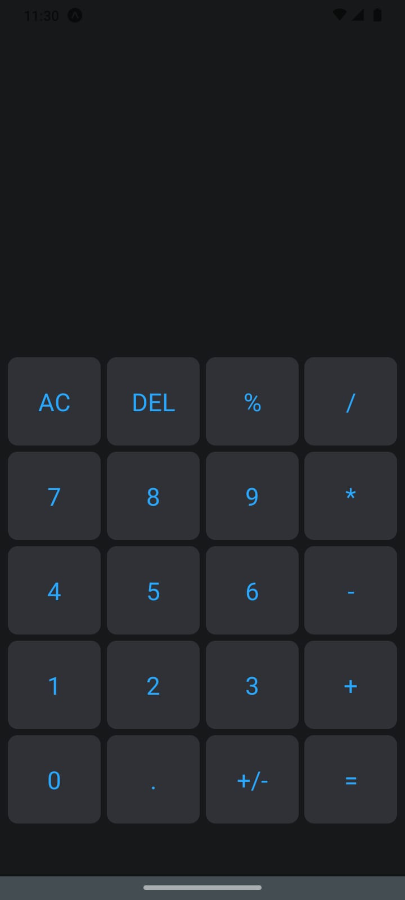

# **Atividade Calculadora**

&emsp;Mini projeto desenvolvido em React Native para fixar conhecimentos sobre uso de estados e manipulação de variáveis para alteração de seus valores seguindo o princípio da imutabilidade do React Native.

- Criação do projeto usando Expo managed TypeScript; ✅
- Utilização de tipagem estática no projeto (TypeScript); ✅
- Estilização de componentes usando a lib styled-components para estilização css; ✅

## Detalhes do projeto desenvolvido
### **Tela da Aplicação**
&nbsp;

  
  

